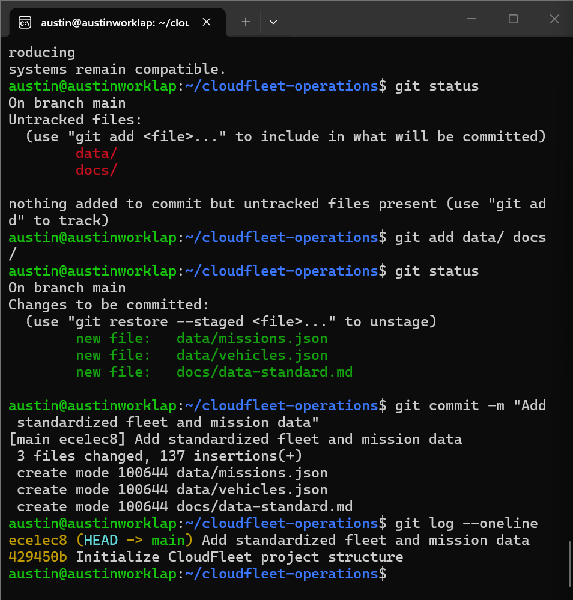
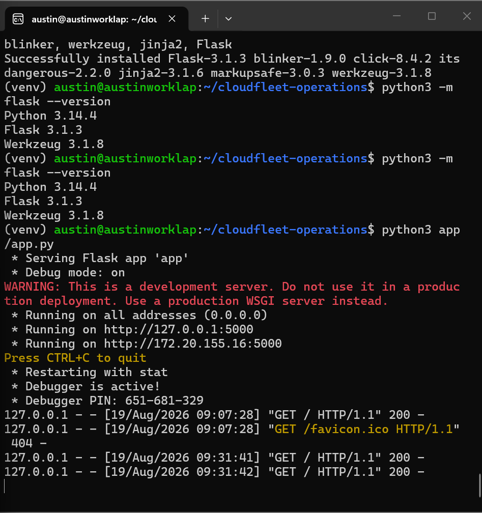
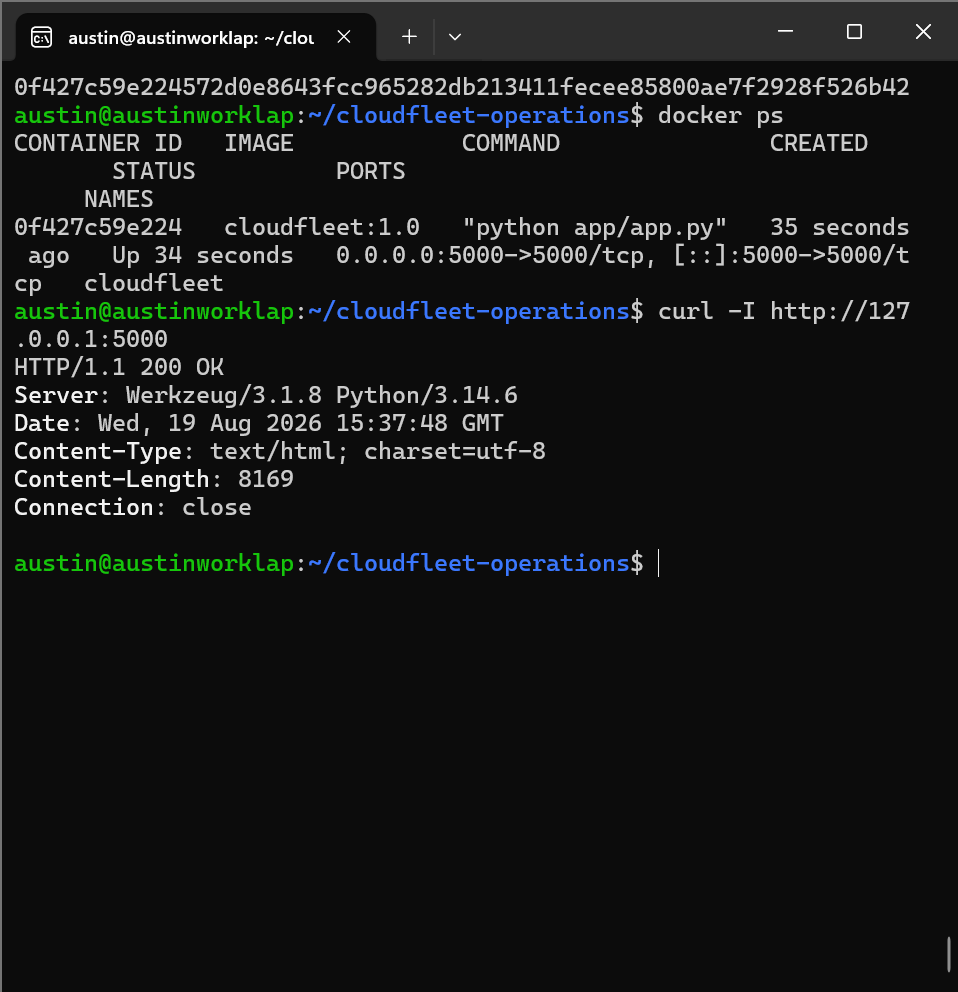
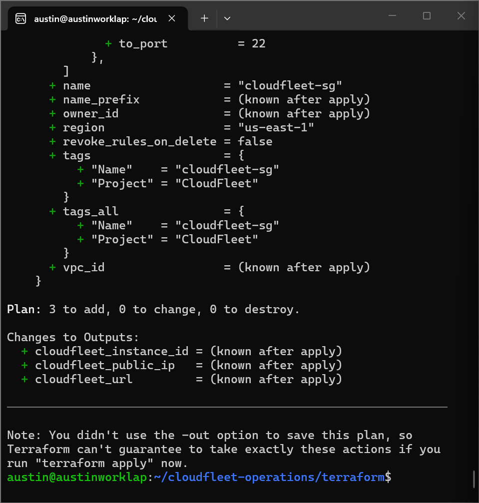
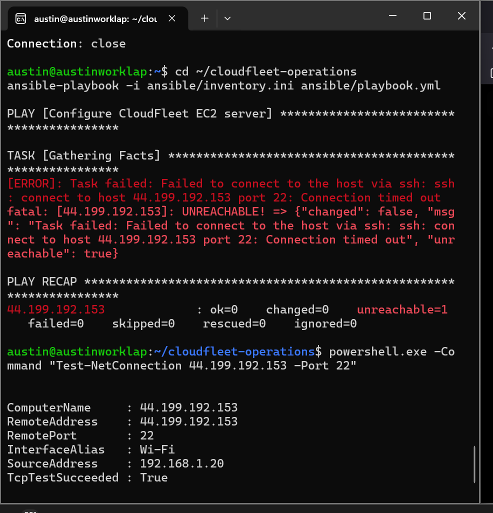
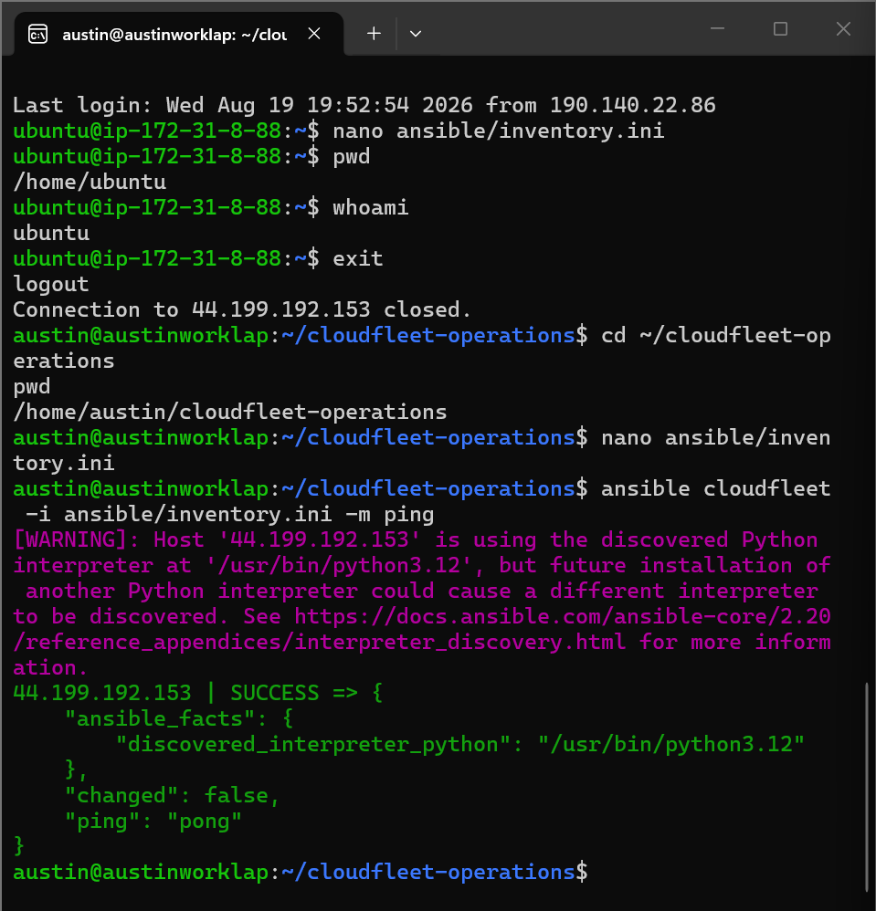
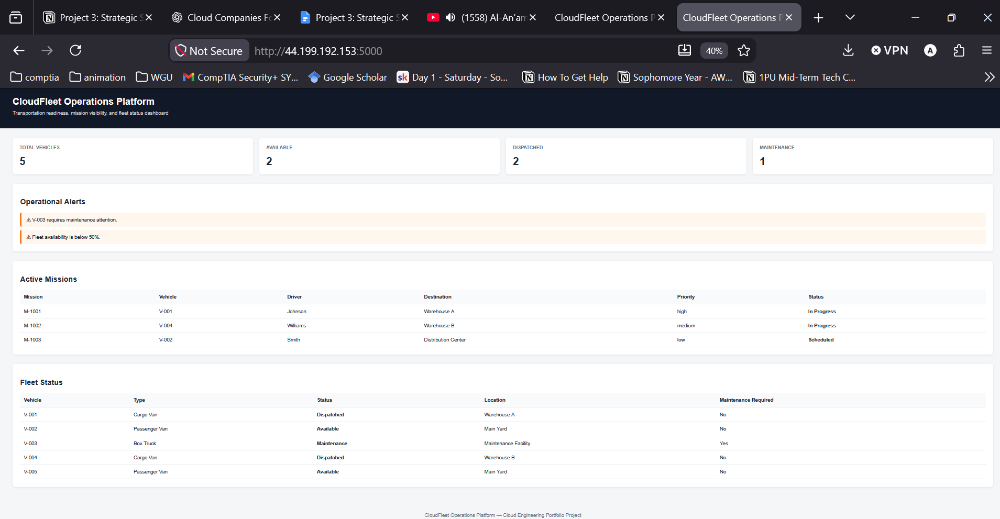
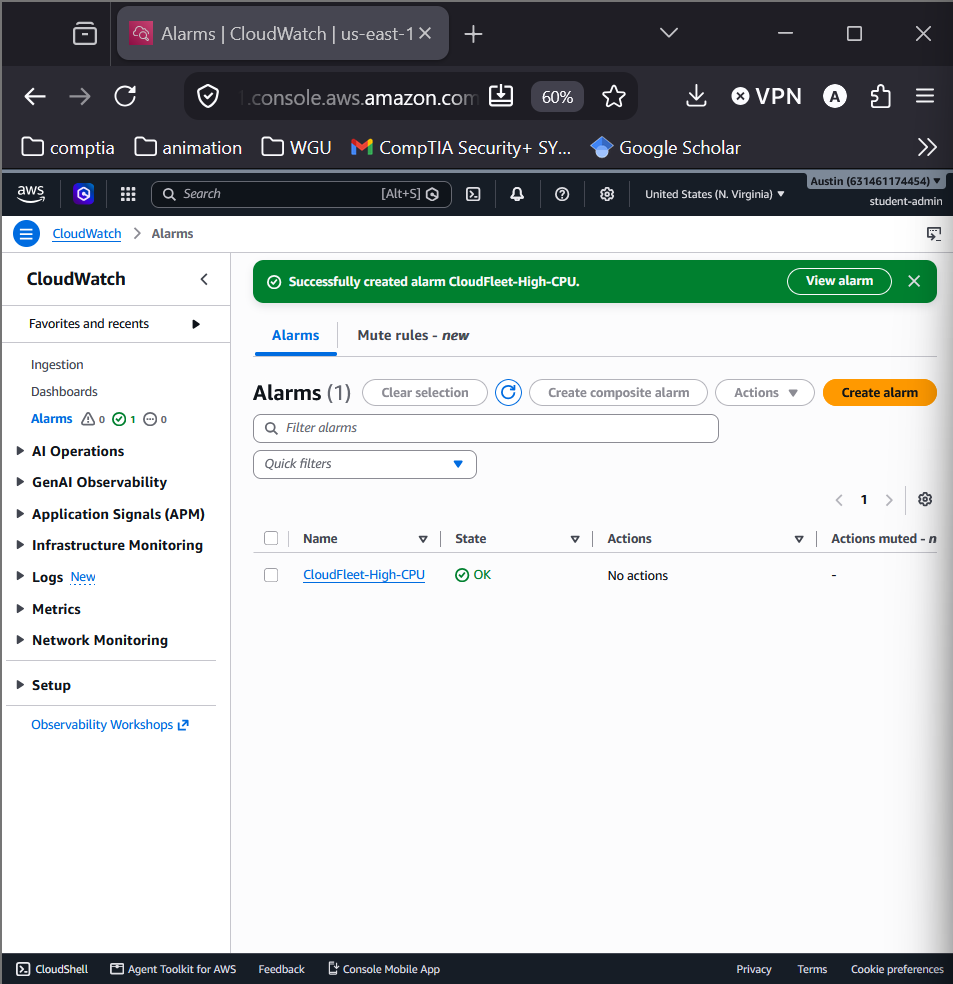
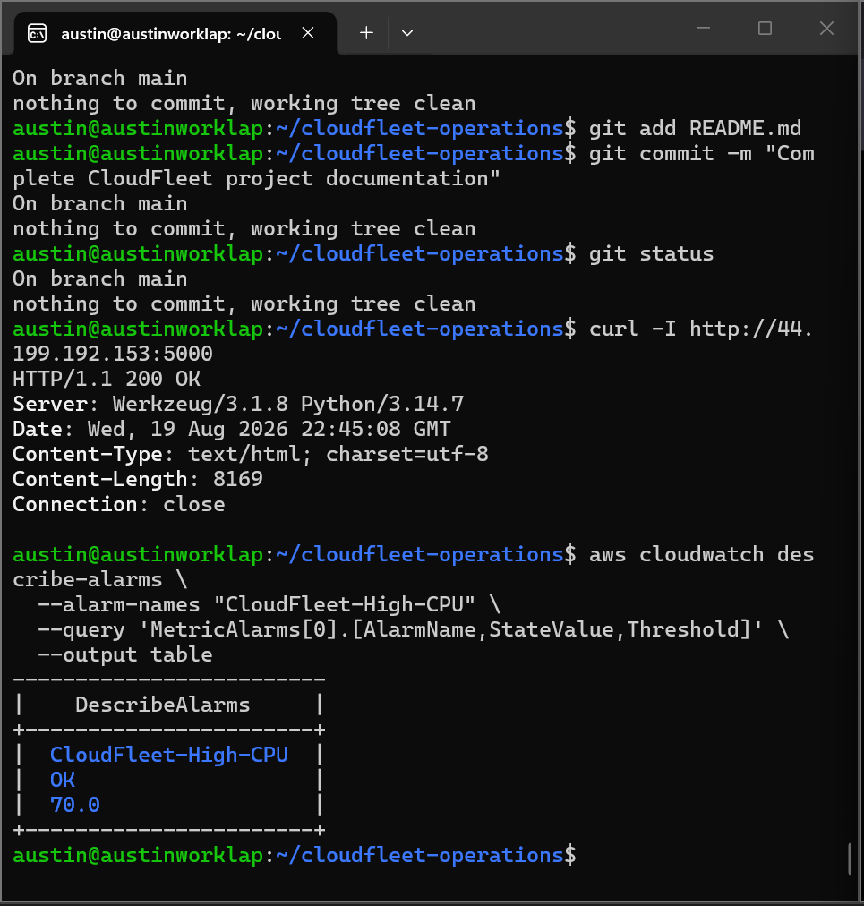

# CloudFleet Operations Platform

CloudFleet Operations Platform is a cloud engineering and DevOps project that demonstrates how modern cloud technologies can support transportation and fleet operations.

The project was inspired by real-world fleet management concepts such as vehicle accountability, mission tracking, dispatch operations, system availability, and operational readiness.

CloudFleet transforms standardized fleet and mission data into a containerized web dashboard deployed to Amazon Web Services (AWS) using Infrastructure as Code (IaC), configuration management, monitoring, and security best practices.

---

## Project Objectives

CloudFleet was designed to demonstrate solutions for several common cloud engineering challenges:

- Data source variability and standardization
- Infrastructure automation
- Application containerization
- Configuration management
- Proactive monitoring and observability
- Secure remote administration
- Troubleshooting and operational documentation
- Repeatable cloud deployments

---

## Architecture

CloudFleet follows this deployment flow:

```text
Fleet & Mission Data
        |
        v
 Standardized JSON
        |
        v
   Python / Flask
        |
        v
      Docker
        |
        v
      Ansible
        |
        v
 Amazon EC2 Instance
        |
        v
  Amazon CloudWatch
```

Terraform provisions the AWS infrastructure supporting the application.

```text
Terraform
   |
   +--> EC2 Instance
   +--> Security Group
   +--> SSH Key Pair
```

---

## Technologies Used

| Technology | Purpose |
|---|---|
| Amazon Web Services (AWS) | Cloud infrastructure platform |
| Amazon EC2 | Hosts the CloudFleet application |
| Amazon CloudWatch | Monitors infrastructure health and CPU utilization |
| Terraform | Provisions AWS infrastructure using Infrastructure as Code |
| Ansible | Configures the EC2 operating system and Docker environment |
| Docker | Packages CloudFleet into a portable container |
| Python | Application programming language |
| Flask | Serves the CloudFleet web dashboard |
| JSON | Standardized fleet and mission data format |
| Git | Version control |
| GitHub | Source code repository and project portfolio |
| Linux / Ubuntu | Server operating environment |
| Windows Subsystem for Linux (WSL) | Local Linux development environment |

---

## Data Standardization

Fleet systems can receive information from multiple sources with inconsistent field names, structures, and formats.

CloudFleet addresses this by using standardized JSON structures for vehicle and mission information.

Example vehicle information includes:

```json
{
  "vehicle_id": "V001",
  "status": "Available",
  "location": "Main Fleet",
  "fuel_level": 85
}
```

Standardization improves:

- Data consistency
- Application reliability
- Automation
- Troubleshooting
- Integration between systems

---

## Application

CloudFleet uses Python and Flask to read standardized fleet data and present operational information through a web dashboard.

The dashboard provides a foundation for displaying information such as:

- Vehicle status
- Mission information
- Fleet availability
- Operational readiness

---

## Containerization

The CloudFleet application is packaged using Docker.

The image was built as:

```bash
docker build -t cloudfleet:1.0 .
```

The container exposes the Flask application through TCP port 5000.

Example:

```bash
docker run -d \
  --name cloudfleet \
  -p 5000:5000 \
  cloudfleet:1.0
```

Containerization provides a consistent runtime environment across local development and cloud infrastructure.

---

## Infrastructure as Code

Terraform provisions the AWS infrastructure required by CloudFleet.

Terraform resources include:

- Amazon EC2 instance
- Security group
- SSH key pair
- Public application endpoint

The infrastructure configuration is stored under:

```text
terraform/
```

Typical deployment workflow:

```bash
cd terraform

terraform init
terraform validate
terraform plan
terraform apply
```

Terraform outputs provide the instance ID, public IPv4 address, and CloudFleet application URL.

---

## Configuration Management

Ansible automatically configures the CloudFleet EC2 server.

The configuration process includes:

- Connecting securely to EC2
- Updating Ubuntu packages
- Installing Docker
- Ensuring Docker is running
- Preparing the server for the CloudFleet application

Ansible connectivity can be tested using:

```bash
ansible cloudfleet \
  -i ansible/inventory.ini \
  -m ping
```

Successful testing returns:

```text
SUCCESS
"ping": "pong"
```

---

## AWS Deployment

CloudFleet was successfully deployed as a Docker container on an Amazon EC2 instance.

The deployment was verified using:

```bash
docker ps
```

and an HTTP request:

```bash
curl -I http://<EC2-PUBLIC-IP>:5000
```

Successful application response:

```text
HTTP/1.1 200 OK
```

This verifies the complete path:

```text
Internet
   |
   v
AWS Security Group
   |
   v
Amazon EC2
   |
   v
Docker
   |
   v
Flask
   |
   v
CloudFleet
```

---

## Monitoring and Observability

Amazon CloudWatch provides proactive monitoring for the CloudFleet EC2 instance.

A CloudWatch alarm named:

```text
CloudFleet-High-CPU
```

monitors:

```text
CPUUtilization
```

Alarm configuration:

- Statistic: Average
- Period: 5 minutes
- Threshold: Greater than 70%
- Resource: CloudFleet EC2 instance

The alarm successfully reached the:

```text
OK
```

state after CloudWatch collected sufficient metric data.

This allows infrastructure health to be monitored proactively instead of waiting for users to report performance problems.

---

## Security

Several security practices were implemented during the project.

### Restricted SSH Access

The original SSH security group rule allowed:

```text
0.0.0.0/0
```

During troubleshooting, the rule was hardened to a single administrator public IPv4 address using a `/32` CIDR block.

This reduces exposure of TCP port 22 to the public internet.

### SSH Key Authentication

CloudFleet uses an ED25519 SSH key pair instead of password authentication.

The private key remains on the administrator's local machine and is excluded from version control.

### Terraform State Protection

Terraform state files are excluded through `.gitignore`.

Examples:

```text
*.tfstate
*.tfstate.*
.terraform/
```

This prevents local infrastructure state from being accidentally committed to the repository.

---

## Troubleshooting

Troubleshooting was intentionally documented throughout the project.

The project currently contains 12 documented troubleshooting scenarios, including:

1. Docker permission denied
2. Terraform outputs unavailable
3. AWS route-table query failure
4. SSH timeout during Ansible configuration
5. EC2 Instance Connect server diagnostics
6. Windows vs WSL network isolation
7. SSH IPQoS connectivity resolution
8. SSH security hardening
9. Ansible connectivity recovery
10. Editing configuration from the wrong host
11. Accidental combined terminal commands
12. AWS CLI CloudWatch command failure

Full documentation is available at:

```text
docs/troubleshooting.md
```

Each incident documents the problem, investigation, resolution, and lesson learned.

---

## Troubleshooting Methodology

The project reinforced a structured troubleshooting process:

```text
Observe the error
       |
       v
Identify the affected layer
       |
       v
Gather evidence
       |
       v
Test one hypothesis
       |
       v
Verify infrastructure health
       |
       v
Implement the smallest safe change
       |
       v
Retest
       |
       v
Document the resolution
```

This approach helped avoid unnecessary infrastructure changes during incidents.

---

## Repository Structure

```text
cloudfleet-operations/
|
|-- app/
|   |-- app.py
|   `-- requirements.txt
|
|-- data/
|   |-- vehicles.json
|   `-- missions.json
|
|-- ansible/
|   |-- inventory.ini
|   `-- playbook.yml
|
|-- terraform/
|   |-- main.tf
|   |-- ec2.tf
|   |-- security.tf
|   |-- key.tf
|   |-- outputs.tf
|   `-- .terraform.lock.hcl
|
|-- docs/
|   `-- troubleshooting.md
|
|-- Dockerfile
|-- .gitignore
`-- README.md
```

---

## Skills Demonstrated

This project demonstrates practical experience with:

- AWS cloud infrastructure
- Amazon EC2 administration
- Amazon CloudWatch monitoring
- Infrastructure as Code
- Terraform
- Ansible configuration management
- Docker containerization
- Python and Flask
- Linux administration
- SSH troubleshooting
- Cloud networking
- Security groups
- VPC routing
- Network Access Control Lists
- Git version control
- Technical documentation
- Systematic troubleshooting

---

## Key Engineering Lesson

Building the application was only one part of the project.

The larger engineering challenge involved making the application:

- Deployable
- Repeatable
- Observable
- Secure
- Troubleshootable
- Documented

CloudFleet demonstrates how application development, infrastructure, automation, networking, security, and operations work together in a cloud engineering environment.

---
---

## Project Evidence

The following screenshots document key milestones from the CloudFleet Operations Platform build and deployment.

### Data Standardization

Validated standardized JavaScript Object Notation (JSON) vehicle and mission datasets before application use.



### Local CloudFleet Dashboard

Developed a Python Flask dashboard that processes fleet and mission information, calculates readiness metrics, and identifies operational alerts.



### Docker Containerization

Built and launched CloudFleet as a Docker container and verified application availability with an HTTP `200 OK` response.



### Terraform Infrastructure Plan

Reviewed the Terraform execution plan before deployment to verify the expected AWS resources would be created.



### Ansible Connectivity

Verified successful remote configuration management access to the Amazon EC2 instance using Ansible.



### SSH Troubleshooting Resolution

Resolved intermittent Secure Shell (SSH) connectivity problems after systematic troubleshooting across AWS networking, EC2 health, Windows Subsystem for Linux (WSL), and SSH client configuration.



### CloudFleet Running on AWS

Successfully deployed the CloudFleet dashboard to an Amazon EC2 instance and accessed the application through the server's public endpoint.



### Amazon CloudWatch Monitoring

Created a proactive Amazon CloudWatch alarm named `CloudFleet-High-CPU` to monitor EC2 processor utilization.



### Final Health Verification

Verified the deployed application returned `HTTP/1.1 200 OK` and confirmed the CloudWatch alarm remained in the healthy `OK` state.


## Cleanup

AWS resources should be destroyed when the project environment is no longer needed to prevent unnecessary cloud charges.

Terraform provides a controlled cleanup process:

```bash
cd terraform
terraform destroy
```

Always review the destruction plan before confirming.

---

## Project Status

**CloudFleet Operations Platform: Successfully deployed to AWS**

Current capabilities include:

- Standardized fleet and mission data
- Flask operations dashboard
- Docker containerization
- Terraform AWS infrastructure
- Ansible server configuration
- Public EC2 application deployment
- CloudWatch monitoring
- SSH security hardening
- Documented troubleshooting workflow
